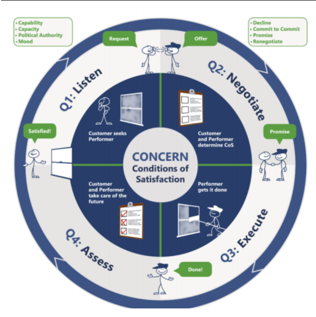

# How Workflow Works

A Workflow is a relationship between two agents, usually two individuals within
an organization, which we call the “Customer” and the “Performer”. The Customer
holds some concern, an objective, for which it seeks satisfaction in some
time-frame. The Performer promises to satisfy by delivering some negotiated
results. In some sense, Workflow can be considered a more general model for
understanding and successfully utilizing OKRs.

A Workflow is a cycle, made up of four quadrants: Listen, Negotiate,
Execute, Assess. The following diagram sumarizes the key aspects of each
quadrant.

## The Four Phases of Workflow

In Q1 (Listen), the Customer seeks out a Performer to help satisfy their objective. They
listen to each other to develop a shared understanding of the concern and if
they would be a good fit to work together.

In Q2 (Negotiate), the Customer and Performer
negotiate on some results (the “conditions of satisfaction”, or CoS), yielding a
promise. This is a commitment by the Performer on how they intend to satisfy
the Customer’s concern.

In Q3 (Execute), the Performer executes on the promise.

In Q4 (Assess), the promise is redeemed, the work is reviewed, satisfaction is determined, and
the cycle repeats. Sometimes, during Q3 (Execution), you discover new
information or something happens that requires a renegotiation, so you go back
to Q2 (Negotiate).

## How Workflow is Used

We use this language directly in our conversations with each other to determine
where we are in an accountability cycle. We say things like, “who is the
Customer for this concern, and who is Performing for them?”, “can we do a Q2 to
negotiate some results for that concern”, “Is that a Q2 promise?”, “can we go
back to Q2 on this”, “let’s do a Q4”, and so on.

While it seems obvious and trivial, it can be used on virtually any scale in an
organization to improve expectations, accountability, empathy, and overall
working relationships. Workflow could be used on the scale of the CEO making
long term promises to the Board of Directors to align the company's strategy,
down to using it on daily Zoom meetings to ensure we’re not wasting our time
and our meetings produce value, and everything in between.

In principle, everything anyone is doing at any time is part of some Workflow.
Each person is likely to be on multiple Workflows at a time, as a customer for
some and a performer for others. Importantly, every workflow has a “dual”
Workflow, in the sense that the Customer is responsible for the Performer’s
success (ie. you could say that the Customer is performing for the Performer,
making a promise to help them be successful). Customership is an active job. It
involves clearly articulating a concern, helpfully negotiating on results,
checking in regularly, and providing helpful feedback. To say it again, the
Customer is responsible for the Performer’s success. Being a good Customer
(ie. taking responsibility for the performer's success) is
one of the hardest and most important components of the Workflow model.

Many Workflows will often remain implicit, and repeated patterns of Workflows
tend to become abstracted into “roles”. The activity of an organization is
essentially its collection of Workflows. We can use the Workflow language to
diagnose and improve communication as necessary, and to organize our overall
planning.

Workflow can be used to describe any organizational structure, even if it’s not
explicitly using the Workflow terminology. Typical management relationships and
reporting lines and so on involve many implicit Workflows and promises. By
surfacing those Workflows and promises explicitly, we can significantly improve
the overall management structure.
